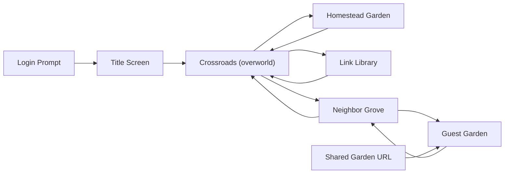
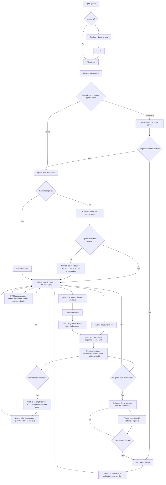

# The Gardn: Current Game Flow

Snapshot of the playable journey as implemented on March 13, 2026.

This is a "where we are now" map, not a pitch for the final game. It reflects the real flow in the current Django + Phaser implementation, mainly in `templates/game/index.html`, `static/game/js/scenes/WorldScene.js`, `static/game/js/scenes/TutorialScene.js`, `static/game/js/scenes/PlantScene.js`, `static/game/js/state.js`, and `game/views.py`.

## Spatial Graph

## Player Journey Flow

## Storyboard

| Beat | What the player experiences now | Main action | What it unlocks or reinforces |
| --- | --- | --- | --- |
| 1. Premise gate | A post-feed, IndieWeb survival pitch and a hard login gate. | Log in to play. | Establishes that this is an account-based, website-backed RPG. |
| 2. Title card | "The small web kept growing anyway." Very short tone-setter. | Press any key or click. | Immediately hands control to the world. |
| 3. Crossroads | The hub map. Elder Aldyn and the Wanderer live here. Portals lead outward. | Walk, talk, explore. | Introduces the game as a hub-and-portal structure. |
| 4. Website onboarding branch | If the player does not have a site yet, the tutorial pushes them toward claiming one, including a NeoCities modal. Existing website owners skip this branch. | Talk to the Elder, claim a plot, then head north. | Makes "own a site" the first real quest. |
| 5. Homestead Garden loop | The personal 8x8 garden is the main home base. Empty plots wait for verified seeds. | Publish something, scan, then plant near an empty plot. | Converts real site activity into visible garden growth. |
| 6. Micropub shortcut | If the player's site supports Micropub, they can publish a note or bookmark from inside the game. | Press `N` or `B`, submit the modal, wait for proof. | Creates pending seeds that later bloom into verified ones. |
| 7. Link Library | A side area with the Archivist and supporting lore about proof, markup, and URLs. | Visit and talk. | Reinforces the game's "proof over rumor" philosophy, but is light on mechanics so far. |
| 8. Neighbor Grove | Once scans discover blogroll or Gardn-roll neighbors, the grove appears. Each neighbor becomes an NPC marker. | Scan for neighbors, then walk the grove and interact. | Turns verified relationships into traversable social space. |
| 9. Guest Garden visit | A neighbor's garden can be entered if that relationship resolves to a Gardn user. The visit is read-only. | Visit, add pollination, return. | Adds social feedback and health bonuses without letting visitors edit the garden. |
| 10. Ongoing play | The HUD always shows seeds, pending work, neighbors, health, site status, and quest progress. | Keep publishing, scanning, planting, and linking out. | This is the current live loop. There is no hard ending yet. |

## Current Shape, In Plain English

- The game already has a strong "proof loop": publish -> scan -> verify -> plant.
- The world map is a small hub with three active branches: garden, library, and neighbors.
- Social play currently means discovering neighbors and visiting their gardens, not co-building inside them.
- Quests exist and progress updates in the HUD, but the game still feels more like a living prototype than a full authored campaign.
- There is no final win state yet. The present endpoint is "maintain your site, grow your garden, and widen your neighborhood."
